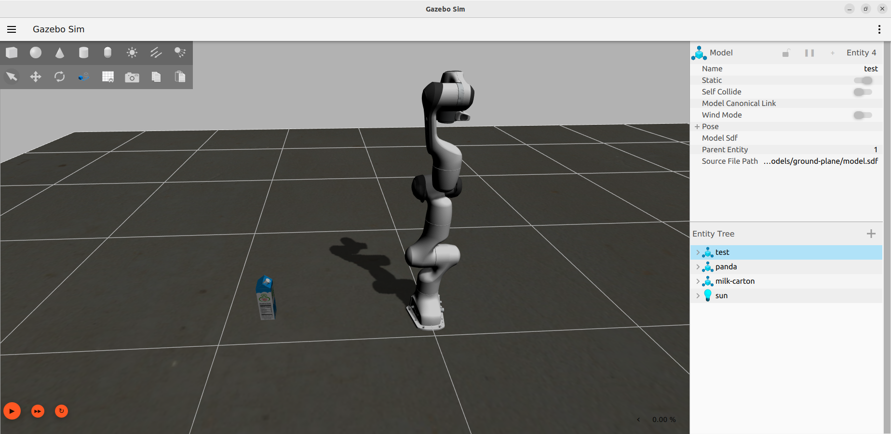

# Research Project: Reinforcement Learning with simulated robots

## Blender SDF Export

## Set GZ_SIM_RESOURCE_PATH

```bash
export GZ_SIM_RESOURCE_PATH="path_to_project/simulation/models"
```

## Start Gazebo Harmonics

When using a VM start garzebo with `--render-engine ogre`

```bash
gz sim simulation/worlds/test-world.sdf --render-engine ogre
```
## Test World

